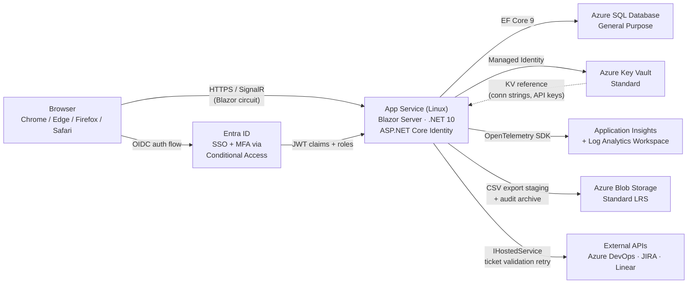

# Architecture — Timesheet & Billing Workflow System

## 1. Component diagram (text)



Request path: Browser → (HTTPS/SignalR) → App Service (Blazor Server) → Azure SQL.
Auth path: Browser → Entra ID OIDC → JWT returned to App Service.
All secrets fetched at startup via Managed Identity → Key Vault references; never in appsettings or source control.

---

## 2. Azure services chosen

| Service | Purpose | SKU (dev) | Est. monthly cost (dev) |
|---|---|---|---|
| App Service Plan (Linux) | Blazor Server host — always-on required for persistent SignalR circuits | Basic B2 (2 vCores, 3.5 GB) | ~$26 |
| Azure SQL Database | Primary relational store — timesheets, entries, approvals, audit log | General Purpose Serverless 1–2 vCore, 32 GB, auto-pause 1 h | ~$40 |
| Azure Blob Storage | CSV export staging (24 h retention) + Log Analytics long-term archive (7-year immutable) | Standard LRS | ~$2 |
| Application Insights | APM, distributed tracing, perf counters, availability tests | Workspace-based, Pay-per-use ~2 GB/day | ~$46 |
| Log Analytics Workspace | Centralised log ingestion; feeds App Insights; exports to Blob for 7-year retention | Per-GB plan ~2 GB/day, 90-day hot | ~$46 |
| Azure Key Vault | Connection strings, integration API keys (DevOps/JIRA/Linear), signing certs | Standard | ~$0.03 |

**Total dev env cost: ~$160/month**

> All services available in Azure South Africa North (Johannesburg). No regional fallback required.
> Prod SKU recommendations are in §6.

---

## 3. Rejected alternatives (with reasons)

- **AKS over App Service** — rejected: operational overhead (node pools, cluster upgrades, networking) unjustified for a single-team line-of-business app at this scale
- **Azure Container Apps over App Service** — rejected: cold-start latency incompatible with Blazor Server's persistent SignalR circuit requirement
- **Cosmos DB over Azure SQL** — rejected: spec requires multi-table joins and ACID transactions (approval chains, locked-entry immutability); no global distribution requirement in §5.2
- **Azure Cache for Redis over in-memory IMemoryCache** — rejected: §5.1 p95 target is 300 ms (not 200 ms); well-indexed Azure SQL + EF Core connection pooling achieves this without a distributed cache at 500–2 000 concurrent users; adds ~$55/month to dev costs
- **Azure Functions over IHostedService (background jobs)** — rejected: ticket validation retry (15-min interval) and export file cleanup are low-volume, predictable schedules; running them as hosted services inside App Service avoids a second compute resource and cold-start latency
- **Azure API Management over direct App Service** — rejected: single Blazor client, no rate-limit-per-consumer or API transformation requirement; single service endpoint is sufficient
- **Azure Front Door over single-region App Service** — rejected: §5.2 specifies single-region (South Africa North); no multi-region failover or WAF requirement at this SLA
- **Azure Service Bus over in-process domain events** — rejected: all approval state transitions are single-producer/single-consumer; no fan-out, no decoupling across services
- **Azure App Configuration over appsettings** — rejected: single team, single environment shape, no dynamic feature-flag toggles required
- **Private Endpoints on App Service + SQL** — rejected: §5.3 SLA target is 99.5% and §5.4 compliance regime is POPIA/GDPR — neither mandates network isolation at this scale; adding Private Endpoints + VNet integration would add ~$80/month and significant operational complexity without a spec-driven requirement; HTTPS-only + TDE + Key Vault satisfies POPIA/GDPR obligations at this tier

---

## 4. Project structure

```
TimeQuest/                          # solution root
  TimeQuest.sln
  src/
    TimeQuest.Web/                  # Blazor Web App (.NET 10, Interactive Server)
      Components/                   # Razor components (pages + shared)
      wwwroot/
      Program.cs
    TimeQuest.Domain/               # Entities, domain interfaces, enums, exceptions
      Entities/
      Interfaces/
      Exceptions/
    TimeQuest.Infrastructure/       # EF Core DbContext, repositories, integrations
      Data/                         # ApplicationDbContext, migrations
      Repositories/
      Integrations/                 # DevOps / JIRA / Linear adapters
      BackgroundServices/           # IHostedService implementations
    TimeQuest.Shared/               # DTOs shared between Web and Infrastructure
  tests/
    TimeQuest.UnitTests/            # xUnit — service and domain logic
    TimeQuest.IntegrationTests/     # xUnit — EF Core against real SQL (testcontainers)
    TimeQuest.E2E/                  # Playwright specs
```

**Justification for split:** The spec mandates a single Blazor Web App with no microservices. The Domain / Infrastructure / Shared split is a layered monolith (not a service split) that enforces dependency direction (Web → Domain ← Infrastructure) and keeps EF Core out of the UI layer. This matches the CLAUDE.md architectural decision: `Components → Services → Repositories → EF Core → SQL Server`.

Data flow within the monolith: `Blazor Components → Service classes (TimeQuest.Infrastructure) → Repositories (TimeQuest.Infrastructure) → EF Core (ApplicationDbContext) → Azure SQL`.

---

## 5. Cross-cutting concerns

- **AuthN/AuthZ:** Azure Entra ID (SSO) via OpenID Connect; ASP.NET Core Identity federated to Entra. Five application roles (`TeamMember`, `TeamLead`, `Administrator`, `FinancialAdmin`, `SystemAdmin`) seeded at startup and mapped from Entra group claims. MFA enforced at the Entra Conditional Access layer — the application does not manage MFA directly. Matches §5.4 (Entra ID + MFA required).
- **Logging / telemetry:** Application Insights via OpenTelemetry SDK; structured JSON logs (Serilog → AI sink). Connection string injected at runtime via Key Vault reference. Log level: Warning in production; Information for auth events and approval state transitions (per §5.6).
- **Config:** `appsettings.json` + `appsettings.{Environment}.json` + environment variables + Key Vault references. No App Configuration service (single team, no dynamic toggle requirement).
- **Secrets:** Azure Key Vault Standard, accessed exclusively via Managed Identity. Key Vault references wired in App Service configuration. No secrets in source control or appsettings files.
- **Health checks:** `/healthz` endpoint exposed via `AddHealthChecks()` — probes SQL connectivity and Key Vault reachability. Probed by App Service (liveness) and Application Insights availability tests.
- **HTTPS / TLS:** HTTPS-only enforced at App Service level (HTTP → HTTPS redirect). Minimum TLS 1.2 per §5.4.
- **Session policy:** Idle timeout 30 minutes; absolute timeout 8 hours; enforced via ASP.NET Core Data Protection + Entra token lifetime policies. Matches §5.4 session defaults.
- **Audit immutability:** `AuditEvents` table has `DELETE` and `UPDATE` SQL permissions revoked from the application service account; append-only enforced at database constraint level per §5.5. Long-term export: Log Analytics → Blob Storage with immutable storage policy (WORM) for 7-year retention.
- **Scope enforcement:** `ScopeGuard` service injected into all domain services; enforces Administrator project/team scope at the service layer (not UI-only) per §4.3 / F4.3.

---

## 6. Environments

| Environment | Purpose | App Service SKU | SQL SKU | Notes |
|---|---|---|---|---|
| **dev** | Developer testing, agent pipeline output | Basic B2 | GP Serverless 1–2 vCore, auto-pause | Always-on off (B2 doesn't support it — use S1 if needed); auto-pause SQL saves cost |
| **qa** (future) | QA / staging validation | Standard S2 | GP Serverless 2–4 vCore | Same shape as dev; separate resource group |
| **staging** (future) | Pre-prod smoke test, production-shape | Premium P1v3 | GP Gen5 2 vCore | Identical to prod; used for final approval before prod deploy |
| **prod** | Live system | Premium P1v3 (scale-out to 2 instances for 99.5% SLA) | GP Gen5 4 vCore, ZRS backup | Zone-redundant Blob Storage; GRS SQL backup; Log Analytics export to immutable Blob |

**Shared vs per-env resources:**
- Log Analytics Workspace: shared across dev + qa (cost saving); separate workspace for prod
- Application Insights: per-environment (separate instrumentation keys prevent dev noise in prod dashboards)
- Azure Key Vault: per-environment
- Blob Storage: per-environment (separate accounts to prevent export cross-contamination)
- Entra ID app registration: single registration with environment-specific redirect URIs

---

## 7. Non-functional decisions

- **§5.1 Performance (p95 < 300 ms API, TTI < 3 s, 200 sustained RPS / 600 peak RPS):** No distributed cache required at this scale and SLA. Well-indexed Azure SQL (clustered indexes on `WeeklyTimesheet.Status + TeamId`, `TimeEntry.UserId + Date`) combined with EF Core connection pooling achieves p95 < 300 ms for approval queue and entry queries. Blazor Server circuit overhead is amortised after the initial SignalR handshake. App Service B2 (dev) / P1v3 ×2 (prod) provides sufficient CPU headroom for 600 peak RPS. Performance baseline to be validated with Application Insights during QA.

- **§5.2 Scalability (500 launch → 2 000 users at 12 months; ~25 GB at 3 years):** Single-region (South Africa North) — no multi-region requirement. App Service horizontal scale-out (2 instances in prod) handles Blazor Server circuit load. Azure SQL GP Gen5 4 vCore in prod comfortably handles projected data volume and concurrent query load. ARR Affinity enabled on App Service to pin Blazor circuits to the same instance (required for server-side Blazor).

- **§5.3 Availability & DR (99.5% SLA, RTO 4 h, RPO 24 h):** Standard/Premium App Service tier provides 99.95% SLA (exceeds 99.5% requirement). Azure SQL GP tier provides 99.99% SLA with automated backups retained 35 days. RPO 24 h satisfied by daily automated SQL backup. RTO 4 h satisfied by documented restore runbook (tested monthly per §5.10). No hot standby region required — 4 h RTO allows cold restore from backup.

- **§5.4 Security & Compliance (POPIA SA, GDPR EU, data residency South Africa North):** All services provisioned in South Africa North. TLS 1.2+ enforced at App Service. Azure SQL Transparent Data Encryption (TDE) at rest. Secrets in Key Vault via Managed Identity. Entra Conditional Access enforces MFA. No cross-border data transfer. POPIA/GDPR obligations (encryption, access control, audit trail, right-to-erasure workflow via Financial Admin) satisfied by TDE + RBAC + append-only audit log. Private Endpoints deferred (not required at 99.5% SLA with POPIA — see §3 rejection).

- **§5.5 Auditing (7-year retention, append-only, POPIA/GDPR regulated):** `AuditEvents` table in Azure SQL with `DELETE`/`UPDATE` permissions revoked at database level. Log Analytics hot retention 90 days; automated export job (IHostedService) writes audit snapshots to Azure Blob Storage with immutable (WORM) policy — 7-year lock. Audit log readers: Financial Admin, System Admin roles only.

- **§5.6 Observability (30-day hot logs, 12-month cold, 5+ alerts, distributed tracing):** Application Insights (workspace-based) for APM, distributed tracing, and metrics. Log Analytics Workspace for centralised ingestion (30-day hot). Nightly export to Blob Storage Archive tier for 12-month cold retention. Five alert rules wired to Action Groups: (1) error rate > 1% over 5 min, (2) approval queue depth > 100 for 48 h, (3) export service failure, (4) integration adapter offline > 30 min, (5) SQL CPU > 80% for 10 min. OpenTelemetry SDK instruments all service calls and hosted services.

- **§5.7 Accessibility (WCAG 2.1 AA):** ARIA labels and roles on all Blazor components. Keyboard-only navigation paths tested as part of QA Playwright suite. Screen-reader smoke test (NVDA) included in QA checklist.

- **§5.8 Browser & Device (responsive, no native app, no offline):** Blazor Server renders on the server; browser receives HTML diffs over SignalR. Responsive CSS grid layout (min viewport 320 px). No service worker / offline caching — live circuit required. No native mobile app in scope.

- **§5.9 Localisation (en-ZA only):** Single culture `en-ZA` configured in `Program.cs`. Date format `dd/MM/yyyy`, 24-hour clock, ZAR currency. No i18n pipeline required.

- **§5.10 Maintainability (80% service coverage, < 5 min CI build, weekly prod deploy):** GitHub Actions CI pipeline: restore → build → unit tests → integration tests → publish. Integration tests use SQL Server testcontainer (no shared dev DB dependency). Playwright E2E as separate workflow gate on staging. Runbook covers: local setup, DB migration, Key Vault credential rotation, backup restore procedure.

- **§5.11 Cost (no cap; architect estimate approved before infra provisioned):** Dev environment ~$160/month (see §2). Prod environment estimated ~$380–450/month (P1v3 ×2 App Service ~$150, GP Gen5 4vCore SQL ~$185, Blob + AI + LA ~$65). Estimate to be presented to Financial Admin for approval before production infrastructure is provisioned.

---

## 8. Open questions for Data Designer

1. **AuditEvents isolation:** Should `AuditEvents` live in the same `ApplicationDbContext` / database as operational data, or in a separate database with its own connection string? Separate DB would make the `DELETE`/`UPDATE` permission revocation cleaner but adds a second connection string and complicates EF migrations.

2. **Soft-delete strategy for TimeEntry:** Locked entries must never be deleted. Should non-locked entries use soft-delete (`DeletedAt` column) or hard-delete? Soft-delete preserves audit trail; hard-delete keeps the table lean. The `AuditService` captures before/after JSON, so hard-delete with audit record is defensible.

3. **WeeklyTimesheet creation trigger:** Should a `WeeklyTimesheet` row be created automatically on the first `TimeEntry` for a week, or explicitly by the user? Auto-creation simplifies the submission flow but creates phantom records for partially-entered weeks.

4. **TicketValidationStatus column type:** Store as `int` (enum backing) or `nvarchar` for readability in raw SQL queries and audit exports? Enum-backed int is more efficient; string is easier for Financial Admin direct SQL queries.

5. **Approval queue index strategy:** The Team Lead queue filters by `Status = 'Submitted'` AND `TeamId IN (...)`. The Financial Admin queue filters by `Status IN ('ApprovedByLead', 'FinancialApproved')`. Filtered non-clustered indexes on `(Status, TeamId)` and `(Status)` respectively — confirm covering columns needed for the list view DTOs to avoid key lookups.

6. **Leave / holiday flag data model (OQ-012 from spec):** The spec defers the UX decision on how Team Members mark leave days. The data model needs to accommodate at minimum a per-day `IsLeave` / `IsHoliday` boolean on `WeeklyTimesheet` or a related `LeaveDay` table. Design should choose the minimal representation that satisfies F1.2 without painting into a corner if an HR integration is added later (OQ-007).

7. **Concurrency control on timesheet status transitions:** Multiple Financial Admins could attempt to lock the same timesheet simultaneously. Recommend `RowVersion` / `ROWVERSION` column on `WeeklyTimesheet` for optimistic concurrency — confirm this is the preferred pattern.

---

## 9. Changelog

- Iteration 1: initial design
