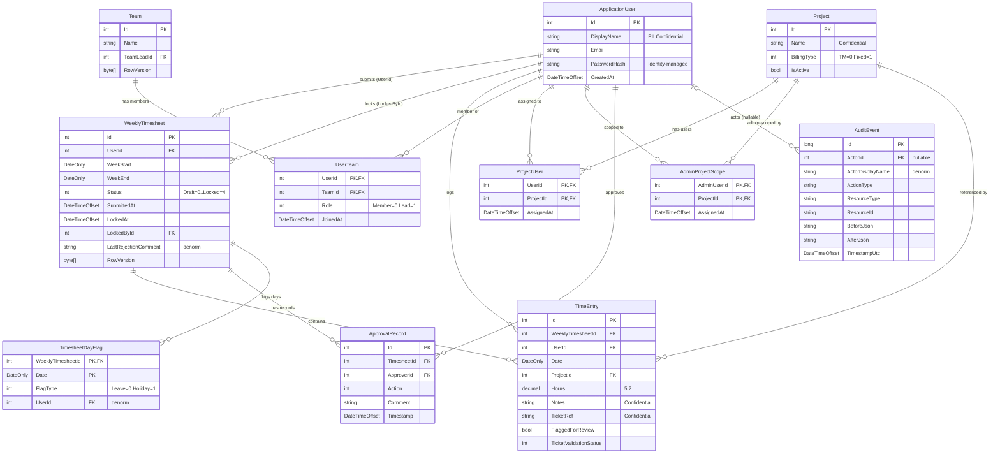

# Data Design — Timesheet & Billing Workflow System

## 1. ER diagram (Mermaid)



---

## 2. Entities (EF Core C# definitions)

> Audit fields (`CreatedAt`, `CreatedBy`, `UpdatedAt`, `UpdatedBy`) on all mutable entities are populated via a `SaveChangesInterceptor` — not shown per-entity for brevity.

```csharp
public enum UserTeamRole         { Member = 0, Lead = 1 }
public enum BillingType          { TM = 0, Fixed = 1 }
public enum TimesheetStatus      { Draft = 0, Submitted = 1, ApprovedByLead = 2, FinancialApproved = 3, Locked = 4 }
public enum ApprovalAction       { LeadApproved = 0, LeadRejected = 1, FinancialApproved = 2, FinancialRejected = 3, Locked = 4 }
public enum TicketValidationStatus { None = 0, Pending = 1, Found = 2, NotFound = 3, Failed = 4, ManuallyApproved = 5 }
public enum DayFlagType          { Leave = 0, PublicHoliday = 1 }
```

```csharp
public class ApplicationUser : IdentityUser<int>
{
    [Required, MaxLength(100)]
    public string DisplayName { get; set; } = string.Empty;  // PII – Confidential

    // Navigation
    public ICollection<WeeklyTimesheet> WeeklyTimesheets { get; set; } = new List<WeeklyTimesheet>();
    public ICollection<TimeEntry>       TimeEntries      { get; set; } = new List<TimeEntry>();
    public ICollection<UserTeam>        UserTeams        { get; set; } = new List<UserTeam>();
    public ICollection<ProjectUser>     ProjectUsers     { get; set; } = new List<ProjectUser>();
    public ICollection<AdminProjectScope> AdminProjectScopes { get; set; } = new List<AdminProjectScope>();
    public ICollection<ApprovalRecord>  ApprovalRecords  { get; set; } = new List<ApprovalRecord>();
    public ICollection<AuditEvent>      AuditEvents      { get; set; } = new List<AuditEvent>();
}
```

```csharp
public class Team
{
    public int Id { get; set; }

    [Required, MaxLength(100)]
    public string Name { get; set; } = string.Empty;

    [MaxLength(500)]
    public string? Description { get; set; }

    public int? TeamLeadId { get; set; }   // nullable — team may exist before a lead is assigned

    [Timestamp]
    public byte[] RowVersion { get; set; } = null!;   // concurrent membership edits

    // Navigation
    public ApplicationUser?          TeamLead  { get; set; }
    public ICollection<UserTeam>     UserTeams { get; set; } = new List<UserTeam>();
}
```

```csharp
public class UserTeam
{
    public int UserId  { get; set; }   // FK → ApplicationUser  (NoAction)
    public int TeamId  { get; set; }   // FK → Team             (Cascade — remove memberships when team deleted)

    [Required]
    public UserTeamRole Role { get; set; }

    public DateTimeOffset JoinedAt { get; set; } = DateTimeOffset.UtcNow;

    // Navigation
    public ApplicationUser User { get; set; } = null!;
    public Team            Team { get; set; } = null!;
}
```

```csharp
public class Project
{
    public int Id { get; set; }

    [Required, MaxLength(100)]
    public string Name { get; set; } = string.Empty;   // Confidential: commercial data

    [Required]
    public BillingType BillingType { get; set; }

    [MaxLength(500)]
    public string? Description { get; set; }

    public bool IsActive { get; set; } = true;   // soft-deactivation — not a global filter

    // Navigation
    public ICollection<ProjectUser>       ProjectUsers       { get; set; } = new List<ProjectUser>();
    public ICollection<AdminProjectScope> AdminProjectScopes { get; set; } = new List<AdminProjectScope>();
    public ICollection<TimeEntry>         TimeEntries        { get; set; } = new List<TimeEntry>();
}
```

```csharp
public class ProjectUser
{
    public int UserId    { get; set; }   // FK → ApplicationUser (NoAction)
    public int ProjectId { get; set; }   // FK → Project         (Cascade)

    public DateTimeOffset AssignedAt { get; set; } = DateTimeOffset.UtcNow;

    // Navigation
    public ApplicationUser User    { get; set; } = null!;
    public Project         Project { get; set; } = null!;
}
```

```csharp
public class AdminProjectScope
{
    public int AdminUserId { get; set; }   // FK → ApplicationUser (NoAction)
    public int ProjectId   { get; set; }   // FK → Project         (Cascade)

    public DateTimeOffset AssignedAt { get; set; } = DateTimeOffset.UtcNow;

    // Navigation
    public ApplicationUser AdminUser { get; set; } = null!;
    public Project         Project   { get; set; } = null!;
}
```

```csharp
public class WeeklyTimesheet
{
    public int Id { get; set; }

    [Required]
    public int UserId { get; set; }            // FK → ApplicationUser (Restrict)

    [Required]
    public DateOnly WeekStart { get; set; }

    [Required]
    public DateOnly WeekEnd   { get; set; }

    [Required]
    public TimesheetStatus Status { get; set; } = TimesheetStatus.Draft;

    public DateTimeOffset? SubmittedAt { get; set; }
    public DateTimeOffset? LockedAt    { get; set; }

    public int? LockedById             { get; set; }   // FK → ApplicationUser (NoAction — breaks cycle)
    public int? LastRejectedByUserId   { get; set; }   // FK → ApplicationUser (NoAction — breaks cycle)

    [MaxLength(1000)]
    public string? LastRejectionComment { get; set; }  // denormalised from most recent rejection ApprovalRecord
    public DateTimeOffset? LastRejectedAt { get; set; }

    [Timestamp]
    public byte[] RowVersion { get; set; } = null!;   // detects concurrent lock attempts by two Financial Admins

    // Navigation
    public ApplicationUser            User           { get; set; } = null!;
    public ApplicationUser?           LockedBy       { get; set; }
    public ApplicationUser?           LastRejectedBy { get; set; }
    public ICollection<TimeEntry>        TimeEntries    { get; set; } = new List<TimeEntry>();
    public ICollection<ApprovalRecord>   ApprovalRecords { get; set; } = new List<ApprovalRecord>();
    public ICollection<TimesheetDayFlag> DayFlags       { get; set; } = new List<TimesheetDayFlag>();
}
```

```csharp
public class TimeEntry
{
    public int Id { get; set; }

    [Required]
    public int WeeklyTimesheetId { get; set; }   // FK → WeeklyTimesheet  (Restrict)

    [Required]
    public int UserId    { get; set; }            // FK → ApplicationUser  (NoAction — redundant for query coverage, breaks cycle)

    [Required]
    public DateOnly Date { get; set; }

    [Required]
    public int ProjectId { get; set; }            // FK → Project          (Restrict)

    [Required]
    public decimal Hours { get; set; }            // decimal(5,2) — max 24.00 per entry; configured in OnModelCreating

    [Required, MaxLength(500)]
    public string Notes { get; set; } = string.Empty;    // Confidential — MUST NOT be emitted to Application Insights logs

    [MaxLength(50)]
    public string? TaskType   { get; set; }

    [MaxLength(100)]
    public string? TicketRef  { get; set; }               // Confidential — MUST NOT be emitted to Application Insights logs

    public bool FlaggedForReview { get; set; } = false;   // set by service when Hours > configured threshold

    public int?            OvertimeValidatedById   { get; set; }   // FK → ApplicationUser (NoAction)
    [MaxLength(500)]
    public string?         OvertimeValidationNote  { get; set; }
    public DateTimeOffset? OvertimeValidatedAt      { get; set; }

    [Required]
    public TicketValidationStatus TicketValidationStatus { get; set; } = TicketValidationStatus.None;

    // Navigation
    public WeeklyTimesheet  WeeklyTimesheet    { get; set; } = null!;
    public ApplicationUser  User               { get; set; } = null!;
    public Project          Project            { get; set; } = null!;
    public ApplicationUser? OvertimeValidatedBy { get; set; }
}
```

```csharp
// Append-only — no Update or Delete permitted on this table
public class ApprovalRecord
{
    public int Id { get; set; }

    [Required]
    public int TimesheetId { get; set; }   // FK → WeeklyTimesheet  (Restrict)

    [Required]
    public int ApproverId  { get; set; }   // FK → ApplicationUser  (Restrict)

    [Required]
    public ApprovalAction Action { get; set; }

    [MaxLength(1000)]
    public string? Comment { get; set; }   // required for LeadRejected / FinancialRejected — enforced in service layer

    [Required]
    public DateTimeOffset Timestamp { get; set; } = DateTimeOffset.UtcNow;

    // Navigation
    public WeeklyTimesheet Timesheet { get; set; } = null!;
    public ApplicationUser Approver  { get; set; } = null!;
}
```

```csharp
// Resolves F1.2 AC2: per-day leave/holiday flag; ValidateForSubmission checks all non-entry days against this table.
// Composite PK chosen over surrogate int to enforce one flag per day per timesheet at the DB level.
// Forward-compatible: if a day needs both Leave and Holiday flags a future migration can add a row per type.
public class TimesheetDayFlag
{
    [Required]
    public int WeeklyTimesheetId { get; set; }   // FK → WeeklyTimesheet (Restrict) — part of composite PK

    [Required]
    public DateOnly Date { get; set; }            // part of composite PK; must fall within WeekStart..WeekEnd

    [Required]
    public DayFlagType FlagType { get; set; }

    [Required]
    public int UserId { get; set; }               // FK → ApplicationUser (NoAction) — denorm for direct (UserId, Date) query

    // Navigation
    public WeeklyTimesheet  WeeklyTimesheet { get; set; } = null!;
    public ApplicationUser  User            { get; set; } = null!;
}
```

```csharp
// Append-only — no Update or Delete permitted on this table
// DELETE and UPDATE permissions revoked on AuditEvents at DB level (SQL DENY)
public class AuditEvent
{
    public long Id { get; set; }   // bigint — 7-year retention × 2000 users × high event rate

    public int? ActorId { get; set; }   // FK → ApplicationUser (SetNull on delete — preserves audit after user erasure)

    [Required, MaxLength(200)]
    public string ActorDisplayName { get; set; } = string.Empty;   // denormalised — survives user deletion / right-to-erasure

    [Required, MaxLength(100)]
    public string ActionType    { get; set; } = string.Empty;   // e.g. "TimeEntry.Created", "Timesheet.Locked"

    [Required, MaxLength(100)]
    public string ResourceType  { get; set; } = string.Empty;   // e.g. "TimeEntry", "WeeklyTimesheet"

    [Required, MaxLength(100)]
    public string ResourceId    { get; set; } = string.Empty;   // string PK repr — accommodates int and Guid entities

    public string? BeforeJson   { get; set; }   // nvarchar(max)
    public string? AfterJson    { get; set; }   // nvarchar(max)

    [Required]
    public DateTimeOffset TimestampUtc { get; set; }

    [MaxLength(50)]
    public string? SourceIp      { get; set; }

    [MaxLength(50)]
    public string? CorrelationId { get; set; }

    // Navigation
    public ApplicationUser? Actor { get; set; }
}
```

---

## 3. Indexes

| Query (feature / screen) | Index name | Columns | Type / notes |
|---|---|---|---|
| Weekly view — load user's week (F1.1, `/timesheet/{weekStart}`) | `IX_WeeklyTimesheet_UserId_WeekStart` | `(UserId, WeekStart)` | **UNIQUE** — also enforces one timesheet per user per week |
| Team Lead queue — submitted timesheets (F2.1, `/approvals`) | `IX_WeeklyTimesheet_Status_SubmittedAt` | `(Status, SubmittedAt)` | Filtered: `WHERE Status = 1` (Submitted); INCLUDE `(Id, UserId, WeekStart, WeekEnd)` |
| Team Lead scope — find teams where user is Lead (F2.1) | `IX_UserTeam_UserId_Role` | `(UserId, Role)` | Filtered: `WHERE Role = 1` (Lead); INCLUDE `(TeamId)` |
| Team membership lookup — which users are in these teams (F2.1) | `IX_UserTeam_TeamId_UserId` | `(TeamId, UserId)` | Covering — used in approval-queue scope JOIN |
| Financial extra-approval queue (F2.4, `/financial/queue`) | `IX_WeeklyTimesheet_Status_LeadApproved` | `(Status)` | Filtered: `WHERE Status = 2` (ApprovedByLead); INCLUDE `(Id, UserId, WeekStart, WeekEnd, SubmittedAt)` |
| Financial lock queue (F3.1, `/financial/lock`) | `IX_WeeklyTimesheet_Status_FinancialApproved` | `(Status)` | Filtered: `WHERE Status = 3` (FinancialApproved); INCLUDE `(Id, UserId, WeekStart, WeekEnd)` |
| Entry list for approval detail (F2.2, `/approvals/{id}`) | `IX_TimeEntry_WeeklyTimesheetId` | `(WeeklyTimesheetId)` | Clustered FK index — EF creates by convention; explicit for clarity |
| Duplicate entry prevention (F1.1 AC: no duplicate date+project per user) | `IX_TimeEntry_UserId_Date_ProjectId` | `(UserId, Date, ProjectId)` | **UNIQUE** — enforces spec constraint at DB level |
| Export locked entries by date range (F3.2, `/financial/export`) | `IX_TimeEntry_Date_WeeklyTimesheetId` | `(Date, WeeklyTimesheetId)` | INCLUDE `(UserId, ProjectId, Hours, Notes, TaskType, TicketRef)`; used with locked-timesheet filtered index join |
| Report queries — locked entries by period (F5.1, `/financial/reports`) | `IX_WeeklyTimesheet_Locked` | `(Status)` | Filtered: `WHERE Status = 4` (Locked); INCLUDE `(Id, UserId, WeekStart, WeekEnd)` |
| Ticket validation pending queue (F6.1, `/sysadmin/integrations`) | `IX_TimeEntry_TicketValidationStatus` | `(TicketValidationStatus)` | Filtered: `WHERE TicketValidationStatus IN (1, 4)` (Pending, Failed); INCLUDE `(Id, TicketRef, Date, UserId)` |
| Admin project scope check (F4.3) | `IX_AdminProjectScope_AdminUserId` | `(AdminUserId)` | INCLUDE `(ProjectId)` — used on every admin request to resolve scope |
| Project user list for admin (F4.2, `/admin/projects/{id}`) | `IX_ProjectUser_ProjectId_UserId` | `(ProjectId, UserId)` | Covering — admin user list page |
| Latest rejection ApprovalRecord for timesheet (WeeklyTimesheetDto rejection fields) | `IX_ApprovalRecord_TimesheetId_Timestamp` | `(TimesheetId, Timestamp DESC)` | Used by service to sync `LastRejection*` denorm fields |
| Audit log search by time + action type (F5.2, `/audit`) | `IX_AuditEvent_TimestampUtc_ActionType` | `(TimestampUtc DESC, ActionType)` | Clustered on `AuditEvents`; supports keyset pagination cursor `(TimestampUtc, Id)` |
| Audit log search by actor (F5.2) | `IX_AuditEvent_ActorId_TimestampUtc` | `(ActorId, TimestampUtc DESC)` | INCLUDE `(ActionType, ResourceType, ResourceId)` |
| Pre-submission leave/holiday check (F1.2 AC2) | `IX_TimesheetDayFlag_WeeklyTimesheetId` | `(WeeklyTimesheetId, Date)` | Composite PK index; covers `ValidateForSubmission` lookup of all flagged days for a week |

---

## 4. Constraints

### FK delete behaviours

| From entity | FK column | To entity | Behaviour | Reason |
|---|---|---|---|---|
| Team | `TeamLeadId` | ApplicationUser | **NoAction** | Team Lead is optional; changing lead shouldn't break anything |
| UserTeam | `UserId` | ApplicationUser | **NoAction** | Breaks multi-FK cycle (UserTeam + WeeklyTimesheet both ref User) |
| UserTeam | `TeamId` | Team | **Cascade** | Remove memberships when a team is deleted |
| ProjectUser | `UserId` | ApplicationUser | **NoAction** | Breaks cycle |
| ProjectUser | `ProjectId` | Project | **Cascade** | Remove assignments if project hard-deleted (projects should be deactivated, not deleted — this is a safety net) |
| AdminProjectScope | `AdminUserId` | ApplicationUser | **NoAction** | Breaks cycle |
| AdminProjectScope | `ProjectId` | Project | **Cascade** | Remove scope if project hard-deleted |
| WeeklyTimesheet | `UserId` | ApplicationUser | **Restrict** | Cannot delete a user who has submitted timesheets (GDPR erasure handled via redaction procedure — see §8) |
| WeeklyTimesheet | `LockedById` | ApplicationUser | **NoAction** | Breaks multi-FK cycle (three FKs to User on same table) |
| WeeklyTimesheet | `LastRejectedByUserId` | ApplicationUser | **NoAction** | Breaks cycle; field is denormalised display data |
| TimeEntry | `WeeklyTimesheetId` | WeeklyTimesheet | **Restrict** | Entries are not cascade-deleted with a timesheet; locked entries are permanent |
| TimeEntry | `UserId` | ApplicationUser | **NoAction** | Redundant denorm FK — breaks multi-FK cycle from TimeEntry to User |
| TimeEntry | `ProjectId` | Project | **Restrict** | Project deletion blocked while time entries reference it |
| TimeEntry | `OvertimeValidatedById` | ApplicationUser | **NoAction** | Breaks cycle (TimeEntry has UserId + OvertimeValidatedById both → User) |
| ApprovalRecord | `TimesheetId` | WeeklyTimesheet | **Restrict** | Preserve approval history; approval records must not be deleted |
| ApprovalRecord | `ApproverId` | ApplicationUser | **Restrict** | Approval record references approver identity for audit integrity |
| TimesheetDayFlag | `WeeklyTimesheetId` | WeeklyTimesheet | **Cascade** | Flags are part of the timesheet; remove flags when timesheet is deleted (only possible for Draft timesheets) |
| TimesheetDayFlag | `UserId` | ApplicationUser | **NoAction** | Denorm FK; breaks potential cascade cycle |
| AuditEvent | `ActorId` | ApplicationUser | **SetNull** | Preserve audit events after GDPR/POPIA user erasure; `ActorDisplayName` remains |

### Cascade cycle check

SQL Server forbids multiple cascade paths into the same table. Verified:

| Table | FKs to same target | Cascade count | Safe? |
|---|---|---|---|
| WeeklyTimesheet | UserId, LockedById, LastRejectedByUserId → ApplicationUser | 0 cascade (all Restrict/NoAction) | ✅ |
| TimeEntry | UserId, OvertimeValidatedById → ApplicationUser | 0 cascade (both NoAction) | ✅ |
| UserTeam | UserId → ApplicationUser (NoAction), TeamId → Team (Cascade) | 0 cycles | ✅ |
| ProjectUser | UserId → ApplicationUser (NoAction), ProjectId → Project (Cascade) | 0 cycles | ✅ |
| AdminProjectScope | AdminUserId → ApplicationUser (NoAction), ProjectId → Project (Cascade) | 0 cycles | ✅ |
| TimesheetDayFlag | WeeklyTimesheetId → WeeklyTimesheet (Cascade), UserId → ApplicationUser (NoAction) | 0 cascades to same target | ✅ |

No cascade cycles. All multi-FK tables use NoAction/Restrict for the cycle-breaking FK.

### Unique constraints

| Entity | Constraint | Columns |
|---|---|---|
| WeeklyTimesheet | `UQ_WeeklyTimesheet_UserId_WeekStart` | `(UserId, WeekStart)` |
| TimeEntry | `UQ_TimeEntry_UserId_Date_ProjectId` | `(UserId, Date, ProjectId)` |
| Team | `UQ_Team_Name` | `(Name)` |
| ApplicationUser | `UQ_AspNetUsers_Email` | `(Email)` — managed by Identity |

### Check constraints

None required at DB level. Business rules (Hours 0–24, comment required on rejection) are enforced in service layer and validated before persistence. DB constraints would duplicate service logic without adding safety for single-app deployments.

### Soft delete strategy

| Entity | Strategy | Notes |
|---|---|---|
| Project | `IsActive` bool (query-time filter) | Not a global query filter — callers explicitly filter `WHERE IsActive = 1`; inactive projects are hidden from time-entry pickers but existing entries are preserved |
| All others | None | Audit log provides event trail; hard deletes are correct for join tables and draft entries |

### Concurrency tokens (RowVersion)

| Entity | RowVersion | Concurrent edit scenario |
|---|---|---|
| WeeklyTimesheet | ✅ | Two Financial Admins lock the same timesheet simultaneously → `DbUpdateConcurrencyException` → caller maps to "already locked" response |
| Team | ✅ | Two Administrators assign/remove members simultaneously |

---

## 5. Seed data

### Identity roles (seeded at startup via `RoleManager<IdentityRole<int>>`)

```csharp
// In SeedData.cs — runs on app startup, idempotent
var roles = new[] { "TeamMember", "TeamLead", "Administrator", "FinancialAdmin", "SystemAdmin" };
foreach (var role in roles)
    if (!await roleManager.RoleExistsAsync(role))
        await roleManager.CreateAsync(new IdentityRole<int>(role));
```

### System actor (all environments)

A system user (Id = -1 by convention, or use `IDENTITY_INSERT`) for audit events generated by background jobs (ticket validation, export cleanup). Seeded via `HasData` or a startup check:

```csharp
// System user — used as ActorId for automated audit events; not a login account
// Email: system@timequest.internal  DisplayName: System
```

### Dev environment seed (Development only)

Seeded by `IHostedService` at startup when `IHostEnvironment.IsDevelopment()`:

| User | Role | Email |
|---|---|---|
| Dev Member | TeamMember | member@dev.local |
| Dev Lead | TeamLead | lead@dev.local |
| Dev Admin | Administrator | admin@dev.local |
| Dev Finance | FinancialAdmin | finance@dev.local |
| Dev SysAdmin | SystemAdmin | sysadmin@dev.local |

Plus one sample team ("Dev Team"), two sample projects ("Project Alpha" — T&M, "Project Beta" — Fixed), and team/project assignments.

### Lookup data

No static lookup tables. `BillingType`, `TimesheetStatus`, `ApprovalAction`, `TicketValidationStatus` are all C# enums stored as `int` columns — no separate DB tables needed.

---

## 6. Migration strategy

### Initial migration

```powershell
dotnet ef migrations add InitialSchema --project TimeQuest
dotnet ef database update --project TimeQuest
```

### Per-feature cadence

Each independently releasable feature gets its own migration, named descriptively:
- `AddOvertimeValidationFields` (if overtime fields are added after initial schema)
- `AddLastRejectionDenormFields` (if added iteratively)

### Down-migration discipline

**Forward-only.** `Down()` bodies are not implemented for this system. Rationale: the `AuditEvents` and `ApprovalRecords` tables are append-only; rolling back a migration that added them would lose data. The runbook covers point-in-time restore (RPO 24h) as the recovery mechanism.

### Non-trivial schema changes

For any destructive migration (rename column, change type, drop column with data):
1. Write a data-migration step in the `Up()` body (copy data to new column before dropping old).
2. Deploy in two phases: additive migration first, destructive migration after verifying data integrity.

---

## 7. Query patterns

### Query 1 — Team Lead approval queue (hottest — runs on every `/approvals` page load)

```csharp
// Step 1: resolve team IDs where current user is Lead
// Uses: IX_UserTeam_UserId_Role (filtered Role=Lead)
var leadTeamIds = await _db.UserTeams
    .Where(ut => ut.UserId == currentUserId && ut.Role == UserTeamRole.Lead)
    .Select(ut => ut.TeamId)
    .ToListAsync();

// Step 2: load submitted timesheets for users in those teams
// Uses: IX_WeeklyTimesheet_Status_SubmittedAt (filtered Status=Submitted)
//       IX_UserTeam_TeamId_UserId (covering)
var queue = await _db.WeeklyTimesheets
    .Where(wt => wt.Status == TimesheetStatus.Submitted
              && _db.UserTeams
                    .Any(ut => leadTeamIds.Contains(ut.TeamId) && ut.UserId == wt.UserId))
    .OrderBy(wt => wt.SubmittedAt)
    .Select(wt => new ApprovalQueueItemDto
    {
        TimesheetId  = wt.Id,
        UserName     = wt.User.DisplayName,
        WeekStart    = wt.WeekStart,
        WeekEnd      = wt.WeekEnd,
        TotalHours   = wt.TimeEntries.Sum(te => te.Hours),
        FlaggedCount = wt.TimeEntries.Count(te => te.FlaggedForReview),
        SubmittedAt  = wt.SubmittedAt
    })
    .ToListAsync();
```

> `TotalHours` and `FlaggedCount` are computed at query time via subquery — see §8 OQ-1 for denormalisation discussion.

---

### Query 2 — Export locked entries by date range (used by F3.2)

```csharp
// Uses: IX_WeeklyTimesheet_Locked (filtered Status=Locked)
//       IX_TimeEntry_Date_WeeklyTimesheetId (with covering INCLUDE)
var entries = await _db.TimeEntries
    .Where(te => te.Date >= fromDate
              && te.Date <= toDate
              && te.WeeklyTimesheet.Status == TimesheetStatus.Locked)
    .OrderBy(te => te.Date)
    .ThenBy(te => te.User.DisplayName)
    .Select(te => new ExportRowDto
    {
        Date         = te.Date,
        UserName     = te.User.DisplayName,
        ProjectName  = te.Project.Name,
        BillingType  = te.Project.BillingType,
        Hours        = te.Hours,
        Notes        = te.Notes,       // Confidential — included only in export, not in logs
        TicketRef    = te.TicketRef,   // Confidential
        WeekStart    = te.WeeklyTimesheet.WeekStart
    })
    .ToListAsync();
```

---

### Query 3 — Audit log search with keyset pagination (F5.2)

```csharp
// Uses: IX_AuditEvent_TimestampUtc_ActionType (clustered, supports keyset cursor)
//       IX_AuditEvent_ActorId_TimestampUtc (when actorId filter present)
var query = _db.AuditEvents.AsQueryable();

if (actorId.HasValue)
    query = query.Where(ae => ae.ActorId == actorId);

if (actionType != null)
    query = query.Where(ae => ae.ActionType == actionType);

query = query
    .Where(ae => ae.TimestampUtc >= fromDate && ae.TimestampUtc <= toDate);

// Keyset cursor — avoids OFFSET degradation on millions of rows
if (cursor != null)
    query = query.Where(ae =>
        ae.TimestampUtc < cursor.Timestamp ||
        (ae.TimestampUtc == cursor.Timestamp && ae.Id < cursor.Id));

var results = await query
    .OrderByDescending(ae => ae.TimestampUtc)
    .ThenByDescending(ae => ae.Id)
    .Take(pageSize + 1)   // +1 to detect "has next page"
    .Select(ae => new AuditLogEntryDto { ... })
    .ToListAsync();
```

---

## 8. Open questions for Backend Dev

1. **`TotalHours` and `FlaggedCount` — compute vs denormalise:** The approval queue (Query 1) computes both via `SUM` and `COUNT` subqueries on `TimeEntry`. At 2 000 users submitting simultaneously, these subqueries will be hot. Consider persisting `FlaggedCount` as a column on `WeeklyTimesheet` (incremented/decremented by `TimeEntryService` on create/update) and `TotalHours` similarly. If denormalised, the Backend Dev must ensure atomic updates (same `SaveChanges` call as the entry mutation) and flag it for the Data Critic to review in a follow-on iteration.

2. **Optimistic concurrency on `WeeklyTimesheet` lock:** When `AppprovalService.FinalLock` receives a `DbUpdateConcurrencyException` (two Financial Admins locking the same timesheet), the service must re-read the timesheet and return an appropriate domain exception (`TimesheetAlreadyLockedException`) rather than a generic 500. The frontend maps this to an informational message.

3. **GDPR/POPIA right-to-erasure procedure:** `WeeklyTimesheet.UserId` uses `Restrict` delete behaviour — a user record cannot be hard-deleted while timesheets exist. The erasure procedure must: (a) redact `ApplicationUser.DisplayName` → `"[Redacted]"`, (b) anonymise `Email` → `"redacted-{Id}@deleted.internal"`, (c) preserve all timesheet and audit records (required for 7-year financial retention). Define this as a dedicated `UserErasureService` — do not attempt a hard delete.

4. **`LastRejection*` denorm sync:** `WeeklyTimesheet.LastRejectionComment`, `LastRejectedByUserId`, and `LastRejectedAt` must be updated atomically within the same `SaveChanges` call as the `ApprovalRecord` insert for every rejection action (`ApprovalService.LeadReject` and `ApprovalService.FinancialReject`). If these diverge, the Team Member sees a stale or missing rejection banner (regression on spec F2.2).

5. **Hours threshold configuration:** The `FlaggedForReview` flag is set when `Hours > threshold`. The threshold value (spec says "> expected hours" but the actual number is OQ-006 from the spec). Backend Dev must wire this as a configurable value in `appsettings.json` (e.g. `"FlagThresholdHours": 10`), not a magic constant. Changing it must not require a migration.

6. **`AuditEvent` keyset cursor serialisation:** The audit log uses a `(TimestampUtc, Id)` keyset cursor (Query 3). The Backend Dev must serialise this as an opaque base64 token to the Blazor component (not a raw page number) to handle concurrent inserts during browsing without skipped or duplicated rows.

7. **`TimeEntry.UserId` redundancy:** This field duplicates `WeeklyTimesheet.UserId` and exists solely for index coverage on duplicate-check and export queries. The Backend Dev must ensure it is always set to `WeeklyTimesheet.UserId` on entry creation and never mutated. Enforce this invariant in `TimeEntryService.CreateEntry` — do not expose `UserId` as a settable parameter on the create DTO.

8. **`AuditEvents` SQL permissions:** The migration must `DENY UPDATE, DELETE ON AuditEvents TO [app-service-account]` to enforce append-only at the database level (spec §5.5 immutability). Confirm the application's SQL Server login name before writing this migration step.

---

## 9. Changelog

- Iteration 1: initial design
- Iteration 2: Added `TimesheetDayFlag` entity (composite PK `WeeklyTimesheetId + Date`, `DayFlagType` enum `Leave/PublicHoliday`, denorm `UserId` FK) to resolve F1.2 AC2 (pre-submission leave/holiday validation). Added `DayFlagType` enum, `IX_TimesheetDayFlag_WeeklyTimesheetId` index, FK entries (WeeklyTimesheetId→Cascade, UserId→NoAction) and cascade-cycle row. Updated ER diagram and `WeeklyTimesheet` navigation collection. Resolves architect §8 OQ-6.
